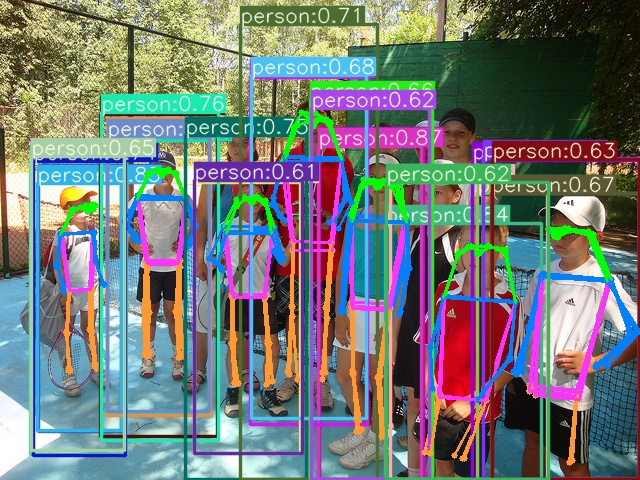

## Calculating the kptloss error.
Method:
Change the original smooth L1 loss function into logarithmic loss function.
original code(loss.py, line 151):
```python
lkpt += kpt_loss_factor*((1 - torch.exp(-d/(s*(4*sigmas**2)+1e-9)))*kpt_mask).mean()
```
changed code:
```python
lkpt += kpt_loss_factor * (torch.log(d + 1 + 1e-9) * kpt_mask).mean()
```

## Export the onnx error.
First generate the onnx model with the the three output shapes:
(1,3,80,80,57); (1,3,40,40,57);(1,3,20,20,57)
Use this output shape to generate the TensorRT engine will might dimension problem when decoding the pred result. 
Method:
According to the README file, change the class IKeypoint code, merge the 3 and 57 in 171. The correct output shape is (1,171,80,80)...

## Add the output shape with (57001, 1, 1)
The meaning of 57001 is pred_target_number(1)+(max_bbox_number(1000)*one_bbox_output(57)
57 means x, y, w, h, class_id, confidence, 17 keypoints(each keypoint has x, y, conf)

## Makefile error
Method:
Make sure link the TensorRT and other libs with the correct pathes.

## abnormal bbox after inference
Method: 
Change the defalut anchor cfg in yololayer.h with the autoanchor generated parameter. Run autoanchor.py to get the optimized anchor config parameters or record the print autoanchor when training the pytorch model.
original anchor config for coco dataset in yololayer.h:
```
    static constexpr YoloKernel yolo1 = {
        INPUT_W / 32,
        INPUT_H / 32,
        {140.0f,301.0f, 303.0f,264.0f, 238.0f,542.0f}
    };
    static constexpr YoloKernel yolo2 = {
        INPUT_W / 16,
        INPUT_H / 16,
        {96.0f,68.0f, 86.0f,152.0f, 180.0f,137.0f}
    };
    static constexpr YoloKernel yolo3 = {
        INPUT_W / 8,
        INPUT_H / 8,
        {19.0f,27.0f, 44.0f,40.0f, 38.0f,94.0f}
    };
```
optimized anchor config with coco-keypoint dataset in yololayer.h:
```
    static constexpr YoloKernel yolo1 = {
        INPUT_W / 32,
        INPUT_H / 32,
        {214.0f,242.0f, 199.0f,378.0f, 352.0f,428.0f}
    };
    static constexpr YoloKernel yolo2 = {
        INPUT_W / 16,
        INPUT_H / 16,
        {65.0f,189.0f, 117.0f,155.0f, 115.0f,297.0f}
    };
    static constexpr YoloKernel yolo3 = {
        INPUT_W / 8,
        INPUT_H / 8,
        {48.0f,64.0f, 38.0f,109.0f, 66.0f,103.0f}
    };
```

## extra bbox for one object
When run yolov7_trt.py, one object has two output bboxes and keypoint like this :

Method:
Change the nms function as below. Since the pose detection has only one category 'person', no need to consider the label_match value. 

```python
  def non_max_suppression(self, prediction, origin_h, origin_w, conf_thres=0.75, nms_thres=0.4):
        """
        description: Removes detections with lower object confidence score than 'conf_thres' and performs
        Non-Maximum Suppression to further filter detections.
        param:
            prediction: detections, (x1, y1, x2, y2, conf, cls_id)
            origin_h: original image height
            origin_w: original image width
            conf_thres: a confidence threshold to filter detections
            nms_thres: a iou threshold to filter detections
        return:
            boxes: output after nms with the shape (x1, y1, x2, y2, conf, cls_id)
        """
        # Get the boxes that score > CONF_THRESH
        boxes = prediction[prediction[:, 4] >= conf_thres]
        # Trandform bbox from [center_x, center_y, w, h] to [x1, y1, x2, y2]
        
        boxes[:, :4] = self.xywh2xyxy(origin_h, origin_w, boxes[:, :4])
        #print("xyxy value is ", boxes[:, :4])
        # clip the coordinates
        boxes[:, 0] = np.clip(boxes[:, 0], 0, origin_w -1)
        boxes[:, 2] = np.clip(boxes[:, 2], 0, origin_w -1)
        boxes[:, 1] = np.clip(boxes[:, 1], 0, origin_h -1)
        boxes[:, 3] = np.clip(boxes[:, 3], 0, origin_h -1)
        #print("the bbox value is", boxes[:, :4])
        # Object confidence
        confs = boxes[:, 4]
        # Sort by the confs
        boxes = boxes[np.argsort(-confs)]
        # Perform non-maximum suppression
        keep_boxes = []
        while boxes.shape[0]:
            iou_output = self.bbox_iou(np.expand_dims(boxes[0, :4], 0), boxes[:, :4])
           # print("the shape of iou output", iou_output.shape)
           # print('check iou output:', iou_output)
            large_overlap = self.bbox_iou(np.expand_dims(boxes[0, :4], 0), boxes[:, :4]) > nms_thres
           # print(large_overlap)
           # label_match = boxes[0, -1] == boxes[:, -1]
           # print('check label_match', boxes[0, -1],'...', boxes[:, -1])            
            # Indices of boxes with lower confidence scores, large IOUs and matching labels
           # invalid = large_overlap & label_match
	    invalid = large_overlap           
           # print(invalid)
            keep_boxes += [boxes[0]]
            boxes = boxes[~invalid]
        boxes = np.stack(keep_boxes, 0) if len(keep_boxes) else np.array([])
        return boxes

```

