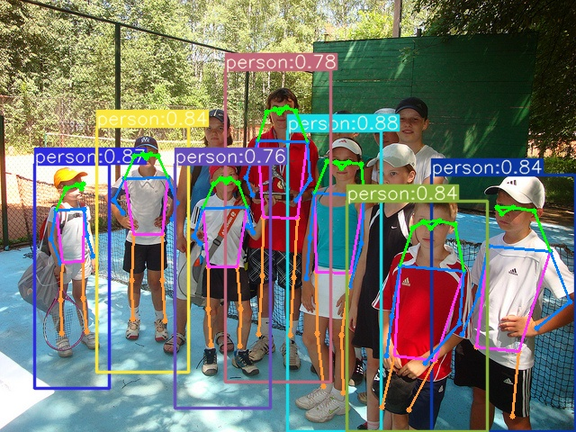

# yolov7-tiny-pose-trt
yolov7-tiny-pose detection using TensorRT


# Pose detection base on Yolov7-tiny Deploy TensorRT
Based on https://github.com/WongKinYiu/yolov7  
https://github.com/nanmi/yolov7-pose/tree/main  
https://github.com/wang-xinyu/tensorrtx/tree/master/yolov7  

# System Requirements

cuda 11.4

TensorRT 8+

OpenCV 4.0+ (build with opencv-contrib module) [how to build](https://gist.github.com/nanmi/c5cc1753ed98d7e3482031fc379a3f3d#%E6%BA%90%E7%A0%81%E7%BC%96%E8%AF%91gpu%E7%89%88opencv)

requirements.txt(run pip3 install -r requirements.txt)

# Train the pytorch model using yolov7-pose repository

1. Make the coco pose dataset with 17 keypoints  
--Download the coco pose detection dataset https://github.com/WongKinYiu/yolov7/releases/download/v0.1/coco2017labels-keypoints.zip  
--Download the coco dataset with the 'person' category by running get_coco_person.py  
--Put the dataset in data dir  
--Modifiy the coco_kpts.yaml  
2. Modifiy the network. If you change the network, you should change the network config file in cfg dir  
3. Train using single GPU by running  
```shell
python3 --data data/coco_kpts.yaml --cfg cfg/yolov7-tiny-pose.yaml --weights "" --batch-size 32 --img 640 --kpt-label --name yolov7-tiny-pose --hyp data/hyp.pose.yaml  
```
4. Fnish training, test the pt model  

# Reparameterization the model

1. Add a class Keypoint and use Keypoint instead of IKeypoint in the yolo-tiny.yaml file  

2. Run deploy.py, the reparameterized model will be generated  

# Export onnx model  

1. Use the reparameterized pytorch model to export onnx model.Need to shield reshap and permute operators like this in the keypoint-related code `class IKeypoint(nn.Module)`
```python
    def forward(self, x):
        # x = x.copy()  # for profiling
        z = []  # inference output
        self.training |= self.export
        for i in range(self.nl):
            if self.nkpt is None or self.nkpt==0:
                x[i] = self.im[i](self.m[i](self.ia[i](x[i])))  # conv
            else :
                x[i] = torch.cat((self.im[i](self.m[i](self.ia[i](x[i]))), self.m_kpt[i](x[i])), axis=1)

            if not self.training:  # inference <------ new add
                bs, _, ny, nx = x[i].shape  # x(bs,255,20,20) to x(bs,3,20,20,85)
                x[i] = x[i].view(bs, self.na, self.no, ny, nx).permute(0, 1, 3, 4, 2).contiguous()
                x_det = x[i][..., :6]
                x_kpt = x[i][..., 6:]

            if not self.training:  # inference
                if self.grid[i].shape[2:4] != x[i].shape[2:4]:
                    self.grid[i] = self._make_grid(nx, ny).to(x[i].device)
                kpt_grid_x = self.grid[i][..., 0:1]
                kpt_grid_y = self.grid[i][..., 1:2]
                ...
```

2. Run pt2onnx.py, the onnx model will be generated. Use Netron to visualize the onnx model like this:
 

use `YoloLayer_TRT_v7.0/script/add_custom_yolo_op.py` to add a new op lookes like this:

 

# Build yolo layer tensorrt plugin

```shell
cd {this repo}/YoloLayer_TRT_v7.0
mkdir build && cd build
cmake .. && make
```
generate `libyolo.so` when build successfully.

# Build TensorRT engine

```shell
cd {this repo}/

trtexec --onnx=yolov7-tiny-pose-op.onnx --fp16 --saveEngine=yolov7-tiny-pose-fp16.engine --plugins={this repo}/YoloLayer_TRT_v7.0/build/libyolo.so
```

wait a long time :satisfied:

TensorRT engine is generated successfully.


# Detect using TensorRT engine through python inference 

put the image in the test_img dir, run yolov7_trt.py, the output will be saved in test_output dir

# Result


